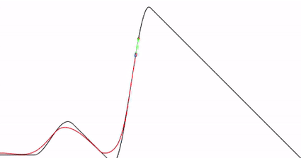

# UNSW Thesis: Pure Pursuit Algorithm & Autonomous Driving

The pdf contains my UNSW thesis "Pure Pursuit Algorithm & Autonomous Driving".

If you are here to see some MATLAB code click [here](Pure%20Pursuit%20Algorithm%20%26%20Autonomous%20Driving.pdf) and scroll down until you see the green writings.

The thesis contains well commented code and all the informations necessary to get it up and running.

 

  
  

 

<b><i>Pure Pursuit Algorithm.<i><b>

 

  
  

 

<b><i>Pure Pursuit Algorithm modified to avoid the cutting of corners.<i><b>

 
 

> *©  2019  Edoardo  M.  Cocconi  All  Rights  Reserved*
